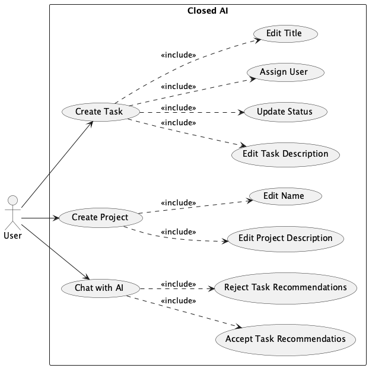
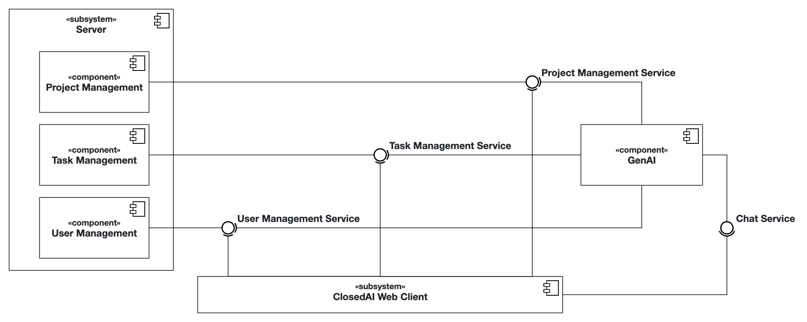
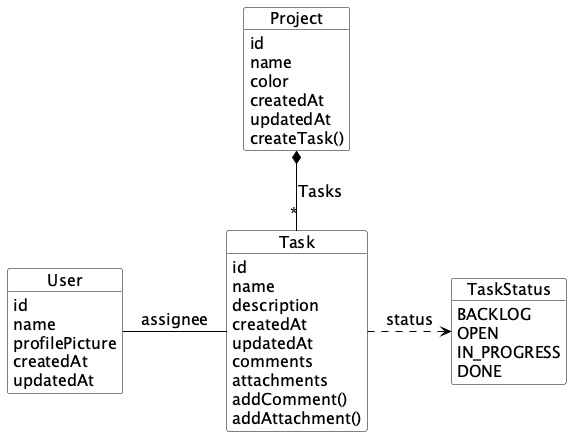
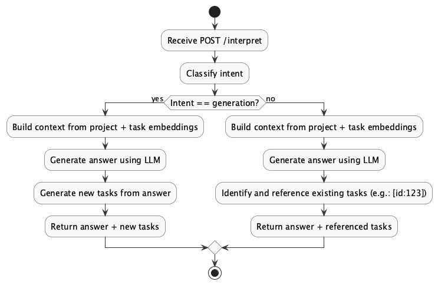

# 🚀 Team ClosedAI

This project is part of the DevOps course at TUM. A collaborative team effort integrating server, client, and AI components with DevOps best practices.

> 📚 For detailed documentation, see our [Problem Statement](docs/problem-statement.md), [System Overview](docs/system-overview.md), and [GenAI Documentation](docs/genai.md)

# 📋 Project Management Application

Our application helps teams organize projects with an intuitive kanban interface ✨ and AI-powered chat assistant 🤖. The system can analyze project context to suggest new tasks or answer questions, making project management simpler for everyone from experienced managers to students.

## Use Scenarios 🎭

> 📚 For detailed use cases and requirements, see our [Problem Statement](docs/problem-statement.md)

1. **Team Setup** 👥: A student team creates a project and builds their task backlog with our kanban board.

2. **New Team Member** 🆕: Bob asks the AI about the project and receives personalized task recommendations matching his React skills.

3. **Solo Developer** 👨‍💻: Charlie uploads project requirements and the AI generates a complete task backlog in one click.

<!-- Show the use case diagram here  -->



## System Architecture 🏗️

> 📚 For detailed architectural information, see our [System Overview](docs/system-overview.md)

Microservice architecture for seamless project management:



### Components

- **Client** 💻: React-based interface for project management and chat.
- **Server** 🖥️: Java Spring Boot microservices:
  - User Service: User management
  - Project Service: Project organization
  - Task Service: Task management
- **GenAI Service** 🧠: Python-based intelligent chat assistant using large language models.

The system uses PostgreSQL with pgvector and pgai for storage and semantic search.

### Object Model 🧩



### GenAI Implementation 🔬

> 📚 For more details, see [GenAI Documentation](genai/README.md)



Our AI classifies user input to generate tasks or answer questions with contextual relevance.

Our AI service uses:

- **LangChain** for orchestrating AI workflows
- **Ollama** for running large language models locally
- **pgvector** for semantic search with vector embeddings
- **pgai** for managing embeddings and vectorization of project data
- **RAG (Retrieval-Augmented Generation)** for context-aware responses
- **Intent Classification** to distinguish between task generation and question answering

The system automatically embeds project and task data, enabling intelligent recommendations and contextual answers.

## Setup & Development 🛠️

### Local Development

```bash
# 1. Clone repository
git clone https://github.com/AET-DevOps25/team-closed-ai.git && cd team-closed-ai

# 2. Setup environment
cp genai/.env.example genai/.env
# Edit the .env file to add your API keys

# 3. Launch all services
docker-compose up
```

Access at http://localhost:5173

This setup includes:

- Client app at port 5173
- Server APIs at various endpoints (users, projects, tasks)
- PostgreSQL database
- Ollama LLM server
- GenAI service with vector database support

### API Docs 📚

- **Server Services**: Each service has its own Swagger documentation:
  TODO: Implement Swagger for each service
  - User Service: http://localhost/users/swagger-ui.html
  - Project Service: http://localhost/projects/swagger-ui.html
  - Task Service: http://localhost/tasks/swagger-ui.html
- **GenAI Service**: http://localhost:8084/docs
- **Traefik Dashboard**: http://localhost:8080
- **OpenAPI Specs**: [Server](server/openapi.yaml) | [GenAI](genai/openapi.yaml)

### Tests ✅

```bash
# Run tests for each component
cd server && ./gradlew test
cd client && npm test
cd genai && python -m pytest
```

## Deployment 🚢

### AWS Deployment ☁️

Our AWS deployment uses Terraform and Ansible with Docker Compose:

Run the following command to setup the resources on AWS:

```bash
cd terraform && terraform apply -auto-approve
```

Run the following command to deploy the application (make sure to setup your environment variables first):

```bash
cd ansible && ansible-playbook -i inventory.yml playbook.yml --extra-vars "ansible_host=<your-aws-instance-ip>"
```

You can also run the [GitHub Action](https://github.com/AET-DevOps25/team-closed-ai/actions/workflows/aws-deployment.yml) for deploying to AWS.

### Kubernetes Deployment 🌐

For Kubernetes deployment we use Helm charts. You can access our application deployed on Rancher here: https://closed-ai.student.k8s.aet.cit.tum.de

### CI/CD Pipeline 🔄

The project uses GitHub Actions for:

- Automated testing
- Linting
- Building Docker images
- Deployment to AWS
- Deployment to Rancher

## Monitoring 📊

- [Grafana](https://closed-ai.student.k8s.aet.cit.tum.de/grafana)

TODO @Simon: Add short introduction of grafana and prometheus

## Team Members 👨‍💻

| Team Member   | Role             |
| ------------- | ---------------- |
| @SimonKaran13 | Server Developer |
| @jakobkoerber | Client Developer |
| @DominikRemo  | GenAI Developer  |
