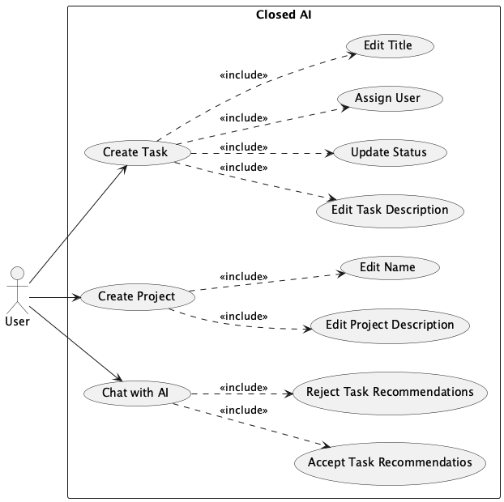

# 📝 System Overview —> Architecture

## 1\. Initial System Structure

- **Server:** Spring Boot REST API
  Our system will be seperated into three main microservices distributed among three developers.

1. Project and Task Organization
   - This service handles the organization of projects and tasks. It provides endpoints for creating, updating, and deleting projects and tasks.
   - It also manages the relationships between projects and tasks, ensuring that tasks are properly associated with their respective projects.
2. Recommender System
   - This service is responsible for generating task recommendations based on user input and project data.
   - It will use the GenAI service to generate recommendations and provide endpoints for retrieving these recommendations.
3. Client Service
   - This service will provide the Client for the application to the users.

- **Client:** React / Angular / Vue.js frontend
  We use a React to provide a user-friendly interface for our application.
  The client communicates with the genai and server services via REST APIs.

- **GenAI Service:** Python, LangChain microservice
  We implemented a GenAI service using Python and LangChain. This service generates task recommendations based on user input and project data.

- **Database:** (e.g., PostgreSQL, MongoDB)
  We use PostgreSQL as our database management system to store project and task data. More specifically, we use a PostgreSQL docker image with preinstalled pgvector and pgai.

- **Vector Database:** (e.g., Pinecone, Weaviate)
  PostgreSQL with pgvector is used as our vector database to store and retrieve vector embeddings for tasks and projects.

## 2\. System Overview

- A simple analysis object model in the form of a UML class diagram
  
- A use case diagram
  
- A UML component diagram to visualize the architecture (this can be understood as the "top-level architecture diagram")
